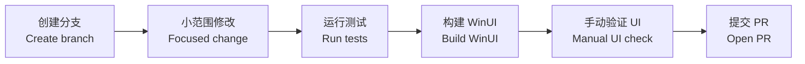

# 贡献指南 / Contributing

> 中文为主 / English follows: OneClickClose 仍处于预发布阶段，欢迎小而清晰、可验证的改动。  
> English: OneClickClose is still pre-release. Small, clear, and verifiable changes are preferred.

## 贡献流程图 / Contribution Flow



## 开发流程 / Development Flow

| 步骤 | 中文说明 | English |
| --- | --- | --- |
| 1 | 从 `main` 创建分支。 | Create a branch from `main`. |
| 2 | UI 改动放在 `src/OneClickClose.WinUI`。 | Put UI changes in `src/OneClickClose.WinUI`. |
| 3 | 进程、配置、扫描、关闭逻辑放在 `src/OneClickClose.Core`。 | Put process, config, scanning, and cleanup logic in `src/OneClickClose.Core`. |
| 4 | 行为变化需要补充或更新测试。 | Add or update tests for behavior changes. |
| 5 | PR 前运行验证命令。 | Run verification commands before opening a PR. |

## 验证命令 / Verification

```powershell
dotnet restore .\OneClickClose.sln
dotnet test .\OneClickClose.sln --no-restore
dotnet build .\src\OneClickClose.WinUI\OneClickClose.WinUI.csproj -c Debug --no-restore
```

UI 或启动相关改动，还需要启动未打包 WinUI 程序并确认窗口真实打开、可响应。  
English: For UI or startup changes, launch the unpackaged WinUI app and confirm a responsive top-level window.

## 项目规则 / Project Rules

| 可以做 / Do | 避免 / Avoid |
| --- | --- |
| 使用现有 WinUI 样式和主题资源。 | 不要散落页面级硬编码颜色。 |
| 保持 Core 和 WinUI 的职责分离。 | 不要让 Core 依赖 WinUI。 |
| 对风险行为保持确认与解释。 | 不要静默强杀应用。 |
| 提交前检查本地文件和敏感信息。 | 不要提交本地路径、私有配置或构建输出。 |
| 小步提交、说明清楚。 | 不要把无关重构混进功能改动。 |

## PR 检查表 / Pull Request Checklist

- [ ] 测试通过 / Tests pass.
- [ ] WinUI 项目可构建 / WinUI project builds.
- [ ] UI 改动已检查亮色和暗色主题 / UI changes checked in light and dark theme.
- [ ] 没有本地文件、密钥或构建输出 / No local-only files, secrets, or build output.
- [ ] 行为变化已更新 README 或 docs / Docs updated for behavior changes.
