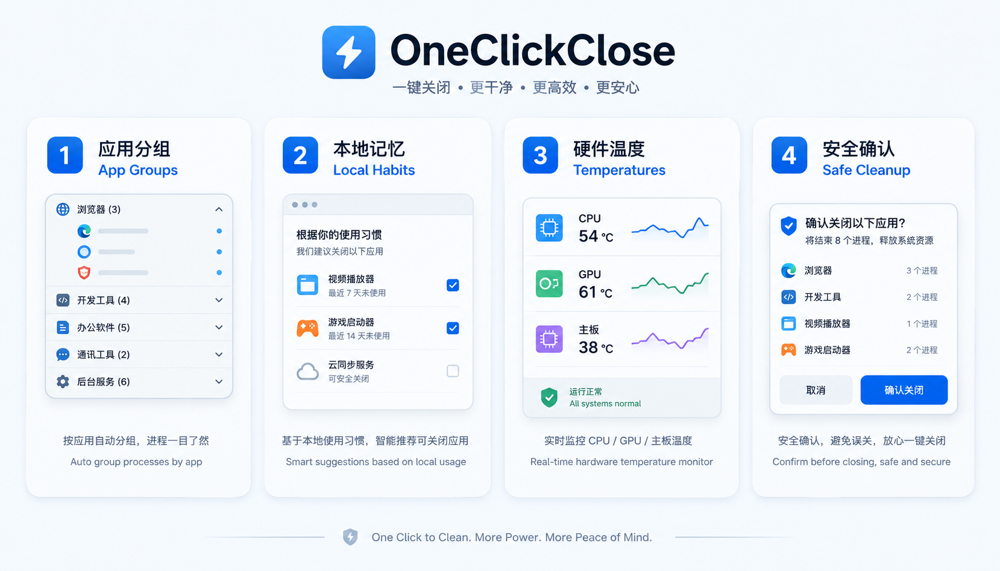
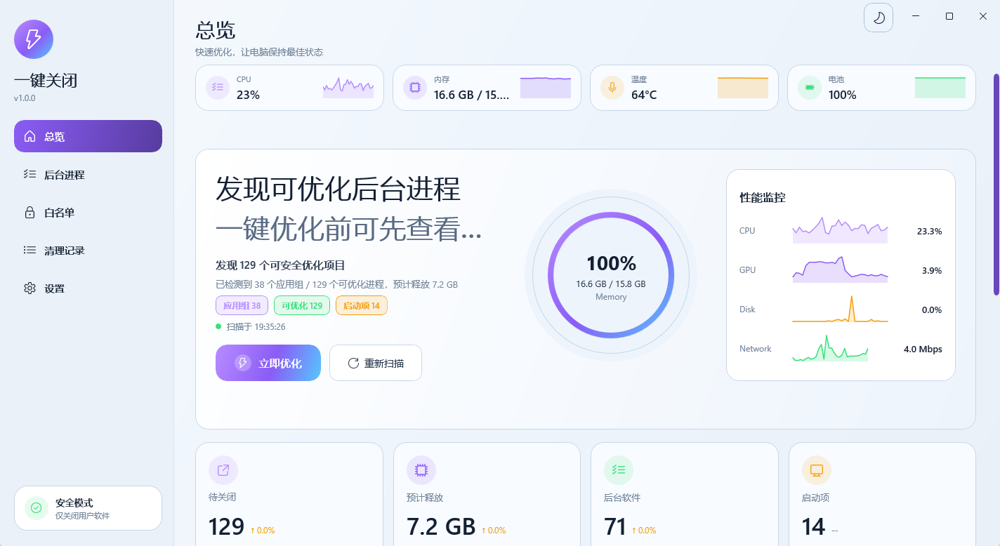
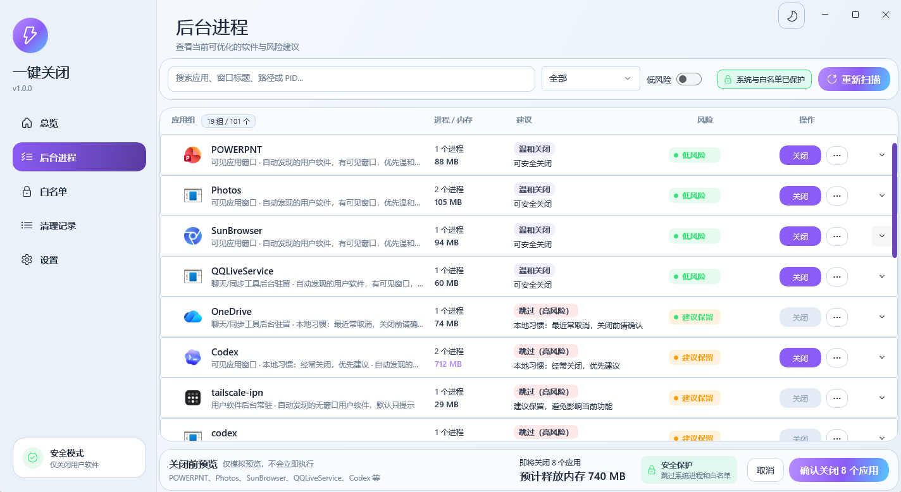
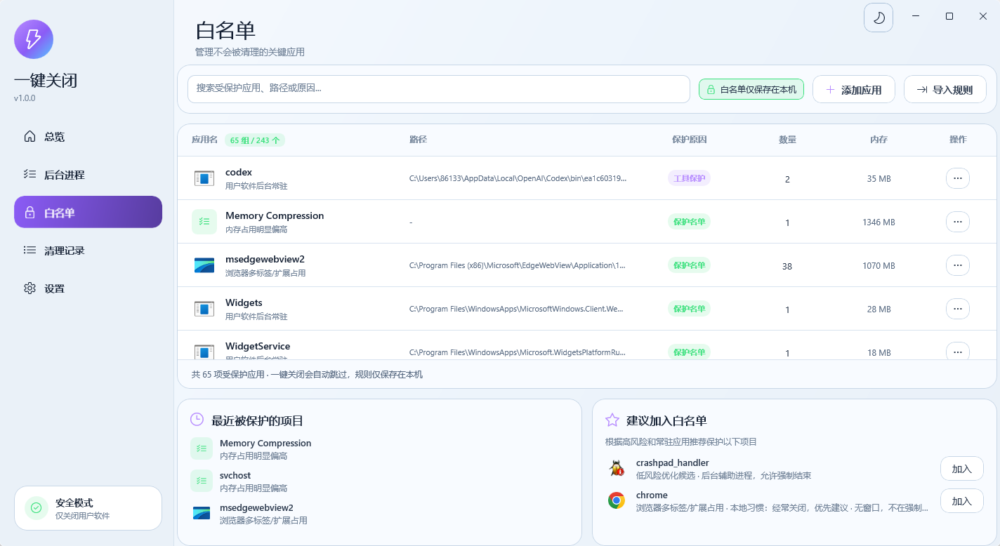
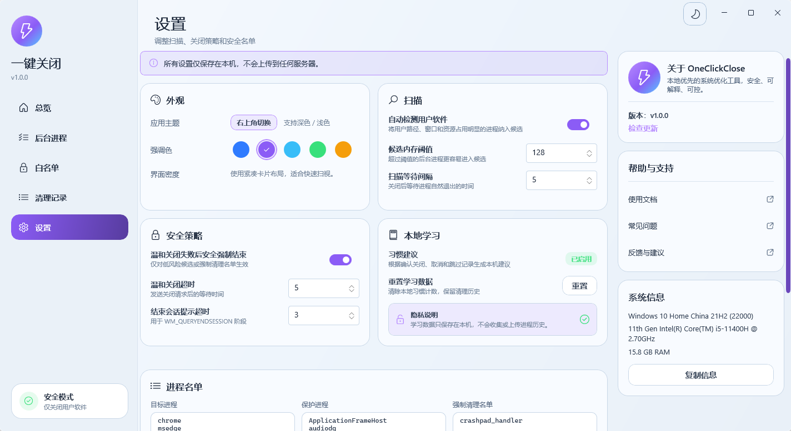
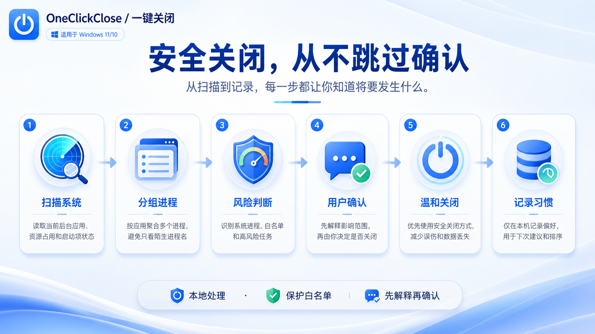
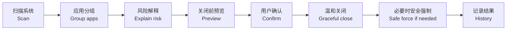

# OneClickClose 一键关闭

> 中文为主 / English follows  
> OneClickClose 是一个本地优先的 WinUI 3 桌面工具，用来查看后台应用、解释关闭风险、按应用分组进程，并在用户确认后安全关闭低风险用户软件。  
> English: OneClickClose is a local-first WinUI 3 desktop utility for reviewing background apps, explaining cleanup risk, grouping processes, and closing low-risk user apps after confirmation.


## 为什么做它 / Why

很多 Windows 软件会在后台留下同步、更新、崩溃上报、托盘和辅助进程。关机或重启前，用户常常只看到“某个应用阻止关机”，却不知道它来自哪里、能不能关、关掉会不会丢数据。

OneClickClose 的目标不是“强杀一切”，而是先把后台软件讲清楚，再让你确认是否关闭。

English: The goal is not to kill everything, but to make background apps understandable before cleanup.

## 当前状态 / Status

| 项目 / Item | 当前状态 / Status |
| --- | --- |
| 阶段 / Stage | 预发布，可公开仓库和试用包 / Pre-release, ready for repository publication and trial builds |
| 技术栈 / Stack | WinUI 3, Windows App SDK, .NET 9 |
| 运行形态 / Runtime | Windows 便携 zip，未打包 WinUI / Portable Windows zip, unpackaged WinUI |
| 隐私边界 / Privacy | 进程列表、清理历史、习惯数据和硬件信息均保存在本机 / Process data, history, habits, and hardware state stay local |
| 安全边界 / Safety | 关闭前确认，默认保护系统进程、白名单和高风险项 / Confirmation first, system and allowlisted processes protected |

## 功能速览 / Features



| 中文 | English |
| --- | --- |
| 后台进程按应用折叠，展开后可看 PID、窗口、路径、内存和原因。 | Group background processes by app, with PID, window, path, memory, and reason details. |
| 微信、TIM、QQExternal、TXPlatform 等后台组件可显示状态与风险原因。 | Shows state and risk reasons for apps such as Weixin, TIM, QQExternal, and TXPlatform. |
| 关闭前预览会区分可关闭、已保护、已跳过和高风险项。 | Preview separates closable, protected, skipped, and high-risk items. |
| 白名单优先级高于自动检测和关机清障规则。 | The allowlist overrides auto-detection and shutdown-blocking cleanup rules. |
| 本地习惯学习只影响建议和排序，不绕过确认。 | Local habit learning affects suggestions and ordering, not confirmation. |
| 支持亮色/暗色主题、清理记录、硬件温度和 Release 启动器。 | Supports light/dark theme, cleanup history, hardware temperature, and a release launcher. |

## 界面预览 / Screenshots

| 总览 / Overview | 后台进程 / Processes |
| --- | --- |
|  |  |

| 白名单 / Allowlist | 设置 / Settings |
| --- | --- |
|  |  |

## 安全关闭流程 / Cleanup Flow





安全原则：

- 不关闭系统路径、系统保护名单、白名单、OneClickClose 自身和 Codex 工具进程。
- 高风险或无法解释清楚的项目默认只提示，不直接关闭。
- 低风险候选也必须经过确认弹窗。
- 配置、清理历史和本地习惯数据默认写入 `%LocalAppData%\OneClickClose`。

## 快速开始 / Quick Start

### 下载 Release 便携包

1. 从 GitHub Release 下载 `OneClickClose-v*-win-x64.zip`。
2. 解压整个文件夹。
3. 双击根目录的 `OneClickClose.exe`。
4. 首次运行前先阅读 [使用文档](docs/USAGE.md) 和 [注意事项](docs/NOTES.md)。

Release 结构：

```text
OneClickClose-v1.0.0-win-x64/
|-- OneClickClose.exe
|-- README.txt
|-- app/
|-- docs/
`-- checksums/
```

English: Download the zip, extract the whole folder, and run `OneClickClose.exe` from the root.

### 从源码运行

```powershell
dotnet restore .\OneClickClose.sln
dotnet build .\src\OneClickClose.WinUI\OneClickClose.WinUI.csproj -c Debug --no-restore -p:RuntimeIdentifier=win-x64
.\src\OneClickClose.WinUI\bin\Debug\net9.0-windows10.0.26100.0\win-x64\OneClickClose.WinUI.exe
```

## 构建与测试 / Build And Test

```powershell
dotnet restore .\OneClickClose.sln -p:RuntimeIdentifier=win-x64
dotnet test .\OneClickClose.sln -c Release --no-restore -p:RuntimeIdentifier=win-x64
dotnet build .\src\OneClickClose.WinUI\OneClickClose.WinUI.csproj -c Release --no-restore -p:RuntimeIdentifier=win-x64
```

打包：

```powershell
powershell -NoProfile -ExecutionPolicy Bypass -File .\scripts\package-release.ps1 -Version 1.0.0 -Runtime win-x64
```

输出：

```text
release/
|-- OneClickClose-v1.0.0-win-x64.zip
|-- OneClickClose-v1.0.0-win-x64.zip.sha256
`-- staging/OneClickClose-v1.0.0-win-x64/
    |-- OneClickClose.exe
    |-- README.txt
    |-- app/
    |-- docs/
    `-- checksums/
```

## 上线体检 / Launch Readiness


公开仓库或发布二进制前，请确认：

- `dotnet test`、WinUI Release build、打包脚本全部通过。
- Release zip 可解压启动，窗口真实打开且响应。
- README、使用文档、注意事项、FAQ、Security、Contributing 已同步。
- 没有提交 `work/`、`output/`、`outputs/`、`release/`、`test-results/`、`bin/`、`obj/`。
- 已搜索密钥、token、本机绝对路径和个人隐私信息。

详细清单见 [GitHub 发布检查表](docs/GITHUB_RELEASE_CHECKLIST.md)。

## 仓库结构 / Repository Layout

```text
.
|-- OneClickClose.sln
|-- close-user-apps.config.json
|-- src
|   |-- OneClickClose.Core       # 扫描、计划、关闭、温度、配置、本地偏好
|   |-- OneClickClose.WinUI      # WinUI 页面、控件、主题、窗口外观
|   `-- OneClickClose.Launcher   # Release 根目录启动器
|-- tests
|   `-- OneClickClose.Core.Tests # 核心行为与主题测试
|-- docs                         # 使用、注意事项、FAQ、发布检查
|-- scripts                      # 发布打包脚本
|-- .github                      # CI、Issue/PR 模板、Dependabot
`-- LICENSE
```

## 文档 / Documentation

- [使用文档 / User Guide](docs/USAGE.md)
- [注意事项 / Important Notes](docs/NOTES.md)
- [常见问题 / FAQ](docs/FAQ.md)
- [开发指南 / Development Guide](docs/DEVELOPMENT.md)
- [GitHub 发布检查表 / GitHub Release Checklist](docs/GITHUB_RELEASE_CHECKLIST.md)
- [贡献指南 / Contributing](CONTRIBUTING.md)
- [安全策略 / Security Policy](SECURITY.md)

## 隐私与边界 / Privacy And Scope

OneClickClose 不上传进程列表、清理记录、习惯学习数据或硬件温度。它也不是杀毒软件、广告拦截器、驱动修复工具或完整电脑管家。

English: OneClickClose keeps runtime data local and is scoped to explainable background-app cleanup.

## License

MIT. See [LICENSE](LICENSE).
