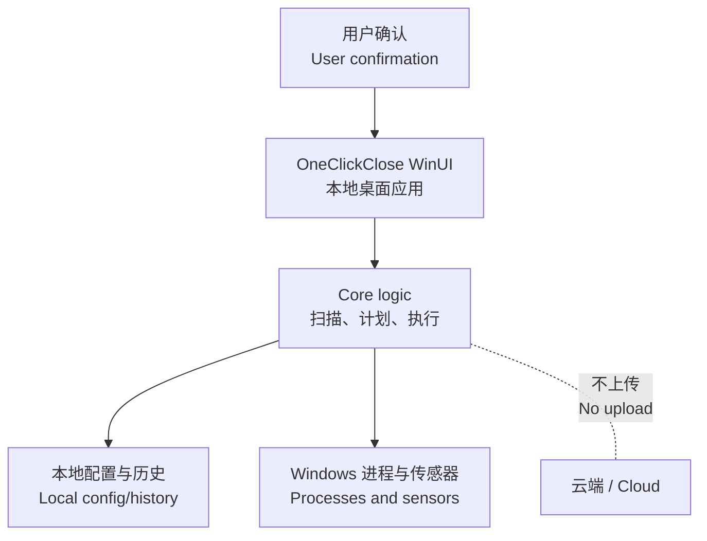

# 安全策略 / Security Policy

> 中文为主 / English follows: OneClickClose 会读取进程信息并可能关闭用户应用，因此与误关进程、权限、传感器读取、本地数据暴露相关的问题都应谨慎处理。
> English: OneClickClose inspects processes and may close user apps, so reports about unsafe process handling, privilege behavior, sensor access, or local data exposure should be handled carefully.

## 安全边界图 / Security Boundary

## 支持版本 / Supported Versions

当前项目处于预发布阶段。安全修复默认进入 `main`，直到开始维护正式版本线。
English: The project is pre-release. Security fixes should target `main` until versioned releases exist.

## 报告漏洞 / Reporting a Vulnerability

如果仓库已上线 GitHub，请优先使用 GitHub private security advisory。若未启用，请先私下联系维护者，不要直接公开敏感细节。
English: Prefer GitHub private security advisories. If unavailable, contact the maintainer privately before posting sensitive details.

请包含 / Please include:

| 信息 | English |
| --- | --- |
| Windows 版本和 CPU 架构。 | Windows version and CPU architecture. |
| 应用构建配置和 commit。 | App build configuration and commit. |
| 复现步骤。 | Steps to reproduce. |
| 是否以管理员身份运行。 | Whether the app was running as administrator. |
| 是否安装第三方硬件监控驱动。 | Whether third-party hardware monitoring drivers were installed. |

## 请勿公开 / Do Not Publish Publicly

- 完整进程列表 / Full process lists.
- 真实用户目录或绝对路径 / Real user profile paths or absolute paths.
- 包含私人应用名称的截图 / Screenshots containing private app names.
- 可直接利用的漏洞细节 / Directly exploitable vulnerability details.

## 隐私承诺 / Privacy Boundary

| 中文 | English |
| --- | --- |
| 不上传进程历史、清理习惯、硬件遥测或用户配置。 | Do not upload process history, cleanup habits, hardware telemetry, or user config. |
| 本地习惯学习仅保存在本机。 | Local habit learning stays on the machine. |
| 清理动作必须保留用户确认。 | Cleanup actions must keep user confirmation. |
