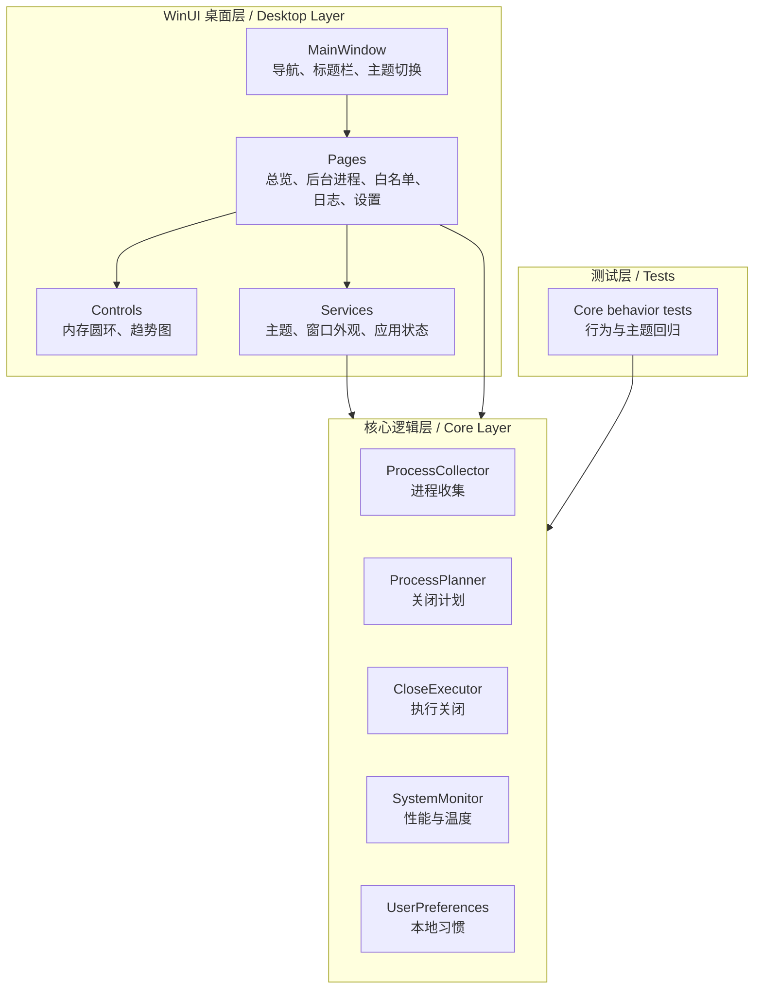
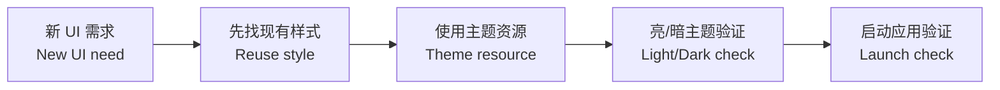

# 开发指南 / Development Guide

> 中文为主 / English follows: 本文面向准备维护 OneClickClose 的开发者，说明项目分层、常用命令、UI 约定和安全边界。  
> English: This guide explains the project layers, common commands, UI conventions, and safety boundaries for maintainers.

## 架构图 / Architecture



## 模块职责 / Module Responsibilities

| 路径 / Path | 中文职责 | English |
| --- | --- | --- |
| `src/OneClickClose.Core` | 扫描、计划、关闭、温度、启动项、配置和本地偏好。 | Scanning, planning, closing, temperature, startup items, config, local preferences. |
| `src/OneClickClose.WinUI` | WinUI 界面、页面、控件、主题、窗口外观和 ViewModel。 | WinUI shell, pages, controls, themes, window chrome, view models. |
| `tests/OneClickClose.Core.Tests` | 核心行为、主题 token 和回归测试。 | Core behavior, theme tokens, and regression tests. |
| `docs` | GitHub 展示、开发流程和发布检查。 | GitHub-facing docs, development flow, release checklist. |

## 本地环境 / Local Setup

| 工具 | 说明 |
| --- | --- |
| Windows | Windows 10 1809+，推荐 Windows 11 |
| .NET | .NET 9 SDK |
| WinUI | Windows App SDK / WinUI 3 workload |
| 可选 | Visual Studio 或 Build Tools，便于 XAML/WinUI 调试 |

初始化 / Restore:

```powershell
dotnet restore .\OneClickClose.sln
```

## 常用命令 / Common Commands

| 场景 | 命令 |
| --- | --- |
| 运行测试 / Run tests | `dotnet test .\OneClickClose.sln --no-restore` |
| Debug 构建 / Debug build | `dotnet build .\src\OneClickClose.WinUI\OneClickClose.WinUI.csproj -c Debug --no-restore` |
| Release 验证 / Release parity | `dotnet build .\src\OneClickClose.WinUI\OneClickClose.WinUI.csproj -c Release --no-restore -p:RuntimeIdentifier=win-x64` |

## UI 开发约定 / UI Guidelines



- 保持 WinUI 3 和 Windows App SDK 主线，不引入新的 UI 框架。  
  English: Stay on WinUI 3 and Windows App SDK; avoid new UI frameworks.
- 共享颜色放在 `Styles/Theme.xaml`，运行时主题 token 放在 `Services/AppThemePalette.cs`。  
  English: Shared colors live in `Theme.xaml`; runtime theme tokens live in `AppThemePalette.cs`.
- 页面不要散落硬编码颜色；优先使用 `StaticResource` 或主题服务。  
  English: Avoid page-local hard-coded colors; prefer theme resources.
- 改标题栏、导航、弹窗、圆环、自绘控件后，需要同时检查亮色和暗色主题。  
  English: Check both themes after title bar, navigation, dialog, ring, or custom control changes.

## 安全边界 / Safety Guidelines

| 中文原则 | English |
| --- | --- |
| 清理建议必须可解释。 | Cleanup suggestions must be explainable. |
| 系统进程、白名单进程和高风险进程不能被轻易关闭。 | System, allowlisted, and high-risk processes must be hard to close accidentally. |
| 本地习惯只影响排序和推荐，不静默强杀。 | Local habits only influence ordering and recommendations; no silent force-kill. |
| 温度不可读时展示原因，不显示假数据。 | Show a reason when temperature data is unavailable; do not fake readings. |

## 提交前检查 / Before Commit

- `dotnet test .\OneClickClose.sln --no-restore`
- `dotnet build .\src\OneClickClose.WinUI\OneClickClose.WinUI.csproj -c Debug --no-restore`
- 对 UI 改动手动启动应用并检查窗口响应。  
  English: For UI changes, launch the app and confirm a responsive window.
