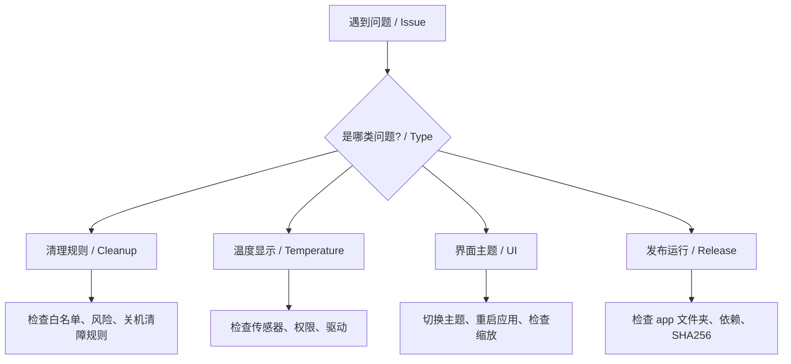

# OneClickClose 常见问题 / FAQ

> 中文为主，英文辅助。  
> Chinese-first FAQ with short English notes.

## 基础问题 / Basics

### OneClickClose 是什么？

OneClickClose 是一个本地优先的 WinUI 3 桌面工具，用于扫描后台软件、按应用分组、解释风险，并在用户确认后关闭低风险用户软件。

English: OneClickClose is a local-first Windows desktop utility for reviewing and closing background user apps.



### 它是电脑管家或杀毒软件吗？

不是。它不做杀毒、广告拦截、垃圾清理或驱动修复。它专注于“看清后台进程”和“安全关闭用户软件”。

### 它会上传我的进程列表吗？

不会。进程列表、清理记录、习惯学习和硬件温度都保存在本机。

## 清理规则 / Cleanup Rules

### “关机清障规则”是什么意思？

它表示：凡是可能阻碍关机的用户软件，都会被纳入关闭候选。

边界很重要：

- 会处理用户软件路径下的进程。
- 会继续保护系统进程和白名单。
- 执行前仍然需要确认。
- 不会绕过确认静默强杀。

English: Shutdown-blocking user apps are included, while system and allowlisted processes stay protected.

### 为什么有些无窗口后台进程也会进入候选？

因为很多阻碍关机的软件不一定有可见窗口，例如同步工具、更新助手、浏览器辅助进程、崩溃上报进程。开启关机清障规则后，低风险用户软件后台进程也会进入候选。

### 会不会误关系统进程？

默认不会。系统路径、保护名单、白名单、OneClickClose 自身和 Codex 工具进程都会被保护。

如果你发现某个软件不应该被关闭，请把它加入白名单。

### “温和关闭”和“强制清理”有什么区别？

温和关闭会先发送窗口关闭请求，让软件自己退出。强制清理会在温和关闭失败后，对符合安全条件的低风险候选执行结束进程。

### 为什么有些进程显示“跳过（高风险）”？

风险评分较高时，应用会只提示不关闭。常见原因包括系统路径、无窗口、内存很低、名字接近系统组件或不符合用户软件特征。

## 白名单 / Allowlist

### 什么软件应该加入白名单？

建议保护：

- 正在编辑文件的 IDE、编辑器。
- 终端、脚本、构建工具。
- 网盘同步、会议、录屏软件。
- 你希望常驻的安全工具或输入法相关工具。

### 加入白名单后还会被关闭吗？

不会。白名单优先级高于关机清障规则和自动检测规则。

### 白名单保存在哪里？

默认保存在本机配置文件 `close-user-apps.config.json` 中。Release 便携包运行后，运行时数据会尽量写入本机用户目录，避免污染发布文件夹。

## 后台进程列表 / Process List

### 为什么同一个软件会折叠成一行？

为了减少重复。浏览器、聊天工具、同步工具常常会启动多个进程，应用会按路径、父应用和进程名合并成应用组。

### 为什么 Codex 或某些软件以前会分成两组？

如果同名进程来自不同路径，默认不会强行合并，避免把不同应用误当成同一个软件。现在分组会优先按主程序路径和父应用判断。

### 展开后看到的 PID、路径有什么用？

用于确认具体要关闭的是哪个子进程。遇到不确定的软件时，建议先展开查看路径，再决定关闭或加入白名单。

### 为什么有些应用图标显示不出来？

可能原因：

- 进程路径不可访问。
- 应用来自 UWP、系统代理或权限受限位置。
- 图标缓存尚未生成。

图标显示失败不会影响扫描和关闭功能，应用会使用备用图标。

## 温度与硬件监控 / Hardware

### 为什么温度不显示？

常见原因：

- 当前机器没有暴露温度传感器。
- 传感器需要管理员权限。
- 主板、CPU 或 GPU 驱动不支持读取。
- LibreHardwareMonitor 无法访问硬件。

温度不显示不影响进程清理功能。

### 为什么温度来源有时是 WMI？

应用优先使用 LibreHardwareMonitorLib。如果它没有读到温度，会回退到 Windows WMI。WMI 在部分机器上不稳定，所以温度可能为空。

### 需要管理员权限吗？

普通功能一般不需要管理员权限。部分温度传感器、某些受保护进程或跨权限进程可能需要管理员权限。

## 主题与界面 / Appearance

### 支持亮色和暗色主题吗？

支持。右上角有主题切换按钮，可以在亮色和暗色之间切换。

### 为什么外部图标和软件内部图标不一样？

这是刻意设计：

- 外部图标用于 exe、任务栏和 Release 启动器。
- 内部图标保留紫色闪电，方便匹配当前 UI 配色。

### 四角白边或底部白线还会出现吗？

当前主题系统已经对窗口背景、边框和 DWM 圆角做过处理。如果仍出现白边，通常和显卡驱动、DPI 缩放、窗口截图方式或系统主题缓存有关。

## Release 包 / Release Package

### 为什么 Release 解压后有 app 文件夹？

WinUI 和 .NET 依赖对路径敏感。根目录只保留启动器和说明文件，完整运行文件放在 `app/` 中，能让目录更整洁，同时避免破坏依赖加载。

### 能不能只保留一个 exe？

暂时不推荐。当前目标是便携、稳定、解压即用，而不是极限单文件压缩。WinUI 3 和 Windows App SDK 的依赖较多，强行合并可能增加启动失败风险。

### 可以移动 app 文件夹里的 DLL 吗？

不建议。`.deps.json`、WinUI 原生依赖和运行时文件都依赖相对路径。

### 为什么 Windows 可能弹出安全提示？

未签名的新软件可能触发 SmartScreen。正式发布前可以考虑代码签名，或在 Release 说明里提供 SHA256 校验。

## 配置与数据 / Config And Data

### 配置文件坏了怎么办？

可以删除或重命名 `close-user-apps.config.json`，应用会生成默认配置。删除前建议备份白名单。

### 如何重置本地习惯学习？

在设置页使用重置本地学习数据功能。它会清除习惯计数和忽略建议，不会删除白名单和清理记录。

### 清理记录会越来越大吗？

清理记录保存在本机。后续可以加入自动裁剪策略；如果你想手动清空，可以在设置页或本机数据目录中删除历史文件。

## 故障排查 / Troubleshooting

### 点击关闭后软件还在运行怎么办？

可能原因：

- 软件拒绝关闭或有未保存数据。
- 软件需要管理员权限才能结束。
- 它是多进程应用，部分子进程被父进程重新拉起。
- 它属于高风险项，被应用保护。

建议先展开应用组查看子进程，再决定是否加入强制清理名单。

### 为什么关闭前还要确认？

这是安全边界。习惯学习和规则只影响建议，不会绕过用户确认。

### 为什么扫描结果和任务管理器不完全一样？

任务管理器和 OneClickClose 的分组口径不同。OneClickClose 更关注用户软件、路径、父进程、窗口状态和关闭风险。

### 为什么某些软件关闭后又出现？

有些软件有守护进程、计划任务或启动项，会自动拉起。可以考虑：

- 检查软件自身设置。
- 检查 Windows 启动项。
- 加入白名单，避免反复关闭。
- 后续使用低风险优化模式降低后台影响。

### 构建失败怎么办？

开发环境建议：

```powershell
dotnet restore .\OneClickClose.sln
dotnet test .\OneClickClose.sln --no-restore
dotnet build .\src\OneClickClose.WinUI\OneClickClose.WinUI.csproj -c Debug --no-restore -p:RuntimeIdentifier=win-x64
```

如果输出目录被占用，请先关闭正在运行的 `OneClickClose.WinUI.exe`。

### 我应该提交哪些文件到 GitHub？

应该提交：

- `src/`
- `tests/`
- `docs/`
- `scripts/`
- `.github/`
- `README.md`
- `LICENSE`

不应该提交：

- `bin/`
- `obj/`
- 本机临时文件。
- Release 解压产物。
- 用户私有配置或运行历史。
