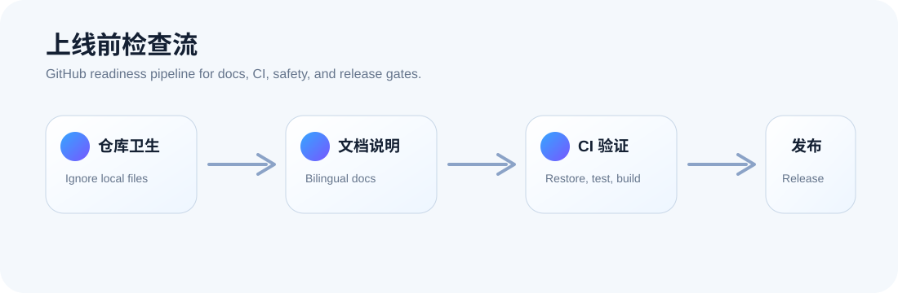
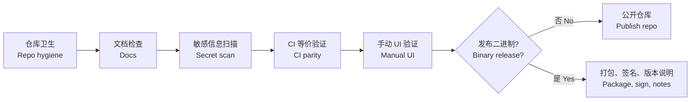

# GitHub 发布检查表 / GitHub Release Checklist

> 中文为主 / English follows: 这份清单用于首次公开仓库、发布二进制或整理 Release 前的最后检查。  
> English: Use this checklist before publishing the repository, creating binaries, or preparing a GitHub Release.



## 总流程 / Release Gate



## 首次推送前 / Before First Push

| 检查项 | English |
| --- | --- |
| `.gitignore` 已排除构建输出、本地工具和私有配置。 | `.gitignore` excludes build outputs, local tools, and private config. |
| `.codex/`、`.agents/`、`.vs/`、`bin/`、`obj/`、`release/`、`TestResults/` 未暂存。 | Local and generated folders are not staged. |
| `README.md`、`CONTRIBUTING.md`、`SECURITY.md` 已审阅。 | Public docs have been reviewed. |
| 已搜索本地路径、密钥、token、个人信息。 | Local paths, secrets, tokens, and personal data have been searched. |
| 已运行完整验证命令。 | Full verification commands have been run. |

## 验证命令 / Verification Commands

```powershell
dotnet restore .\OneClickClose.sln -p:RuntimeIdentifier=win-x64
dotnet test .\OneClickClose.sln -c Release --no-restore -p:RuntimeIdentifier=win-x64
dotnet build .\src\OneClickClose.WinUI\OneClickClose.WinUI.csproj -c Release --no-restore -p:RuntimeIdentifier=win-x64
powershell -NoProfile -ExecutionPolicy Bypass -File .\scripts\package-release.ps1 -Version 1.0.0 -Runtime win-x64
```

## 敏感信息扫描 / Secret And Local Path Scan

```powershell
rg -n --hidden `
  --glob '!work/**' `
  --glob '!output/**' `
  --glob '!outputs/**' `
  --glob '!release/**' `
  --glob '!**/bin/**' `
  --glob '!**/obj/**' `
  "(?i)(token|secret|password|api[_-]?key|bearer|gho_|sk-)"
```

如果命中真实密钥、token、私人路径或含私人软件名的截图，请先移除并轮换相关凭据。

## UI 手动验证 / Manual UI Checks

| 页面/能力 | 检查点 |
| --- | --- |
| 启动 / Startup | 应用启动后窗口真实打开且响应。 |
| 主题 / Theme | 亮色、暗色主题均可读，无白边、无漂移。 |
| 导航 / Navigation | hover、pressed、selected 状态过渡自然。 |
| 内存圆环 / Memory ring | 0%、中间值、100% 均正确渲染。 |
| 温度 / Temperature | 显示真实数据，或显示明确的不可用原因。 |
| 后台进程 / Process groups | 默认折叠，展开/收起、搜索、动作正常。 |

## 公开二进制前 / Before Public Binary Release

- 决定发布形态：未打包 zip、MSIX，或两者都支持。  
  English: Decide the package shape: unpackaged zip, MSIX, or both.
- 稳定后再增加签名和自动 Release workflow。  
  English: Add signing and automated release only after packaging stabilizes.
- 在干净 Windows 用户环境测试。  
  English: Test on a clean Windows user profile.
- 分别测试普通权限和管理员权限。  
  English: Test with and without administrator permissions.
- 在有/无硬件传感器支持的机器上测试温度读取。  
  English: Test machines with and without hardware sensor support.
- Release notes 要写清楚已知限制。  
  English: Release notes should clearly list known limitations.
- Release zip 内应只有一个顶层目录；解压后的包目录只保留 OneClickClose.exe、README.txt、app/、docs/、checksums/。  
  English: The zip should contain one top-level folder; the extracted package folder should only show OneClickClose.exe, README.txt, app/, docs/, and checksums/.
- Release zip 内的 docs/ 应包含使用文档、注意事项、FAQ 和必要截图。  
  English: The release zip should include user guide, important notes, FAQ, and required screenshots.
- 将 release 目录生成的 .zip 和 .zip.sha256 一起上传到 GitHub Release。  
  English: Upload both the generated .zip and .zip.sha256 from the release folder.

## 已知预发布限制 / Known Pre-release Limits

| 限制 | English |
| --- | --- |
| 硬件温度依赖传感器、驱动和权限。 | Hardware temperature depends on sensors, drivers, and permissions. |
| 暂无自动二进制发布流程。 | No automated binary publishing workflow yet. |
| 项目定位是后台应用治理，不是杀毒或完整电脑管家。 | Scope is background app cleanup, not antivirus or a full PC manager. |
