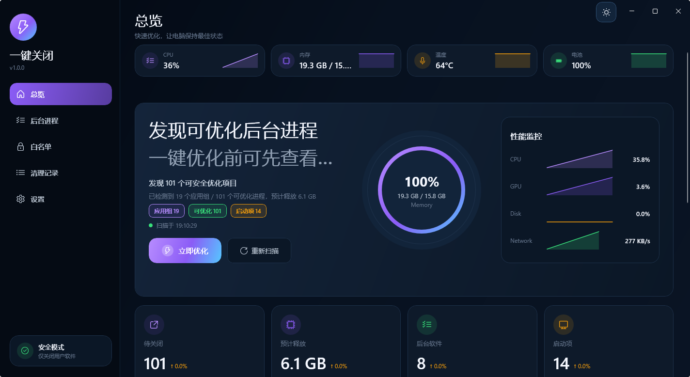
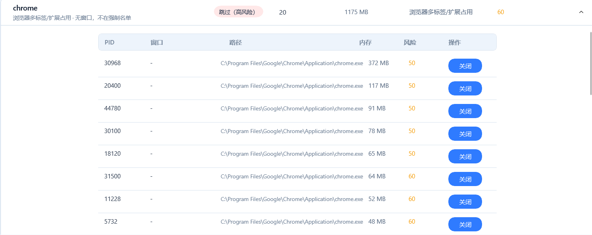
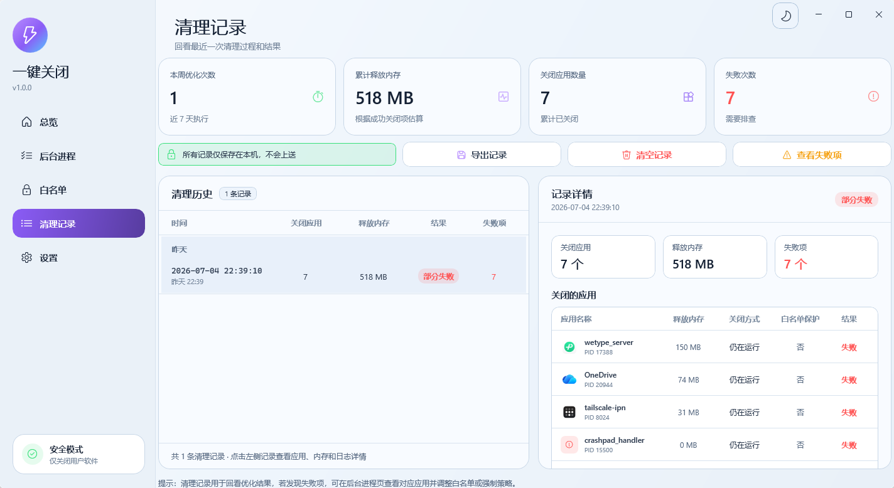
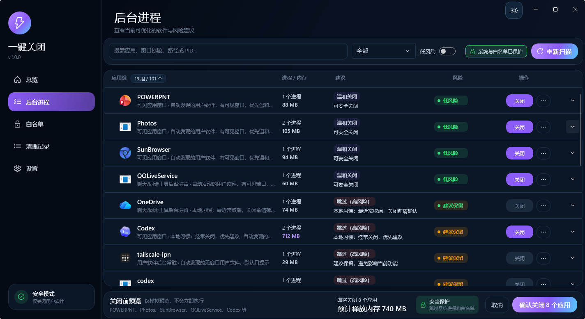

# OneClickClose 使用文档 / User Guide

> 中文为主，英文辅助。  
> Chinese-first guide with short English hints.

OneClickClose 是一个本地优先的 WinUI 3 桌面工具，用于扫描后台软件、按应用折叠进程、解释风险，并在你确认后关闭可能影响性能或阻碍关机的用户软件。

OneClickClose is a local-first WinUI 3 desktop utility for reviewing background apps, grouping processes, explaining risk, and closing user apps after confirmation.


使用前建议先阅读 [注意事项 / Important Notes](NOTES.md)，特别是白名单、配置位置和 Release 包结构。

## 1. 适用场景 / When To Use

适合这些情况：

- 电脑关机、重启时总有软件卡住。
- 后台软件太多，想快速查看哪些可以关闭。
- 想按应用组查看多个同名进程，例如浏览器、聊天工具、同步工具。
- 想保护某些软件，避免一键关闭时误关。
- 想查看清理前后释放了多少内存。

Not intended for:

- 杀毒、广告拦截、系统修复。
- 绕过 Windows 权限强制管理系统服务。
- 无确认地静默强杀所有进程。

## 2. 安装与启动 / Install And Launch

### Release 便携包

从 GitHub Release 下载 `OneClickClose-v*-win-x64.zip` 后解压。推荐目录结构如下：

```text
OneClickClose-v1.0.0-win-x64/
|-- OneClickClose.exe
|-- README.txt
|-- app/
|-- docs/
`-- checksums/
```

双击根目录的 `OneClickClose.exe` 启动。真正的 WinUI 程序和依赖保存在 `app/` 内，不建议手动移动 DLL。

English: Download the release zip, extract it, and launch `OneClickClose.exe` from the root folder.

### 本地开发版

```powershell
dotnet restore .\OneClickClose.sln
dotnet build .\src\OneClickClose.WinUI\OneClickClose.WinUI.csproj -c Debug --no-restore -p:RuntimeIdentifier=win-x64
.\src\OneClickClose.WinUI\bin\Debug\net9.0-windows10.0.26100.0\win-x64\OneClickClose.WinUI.exe
```

## 3. 主界面总览 / Overview

总览页用于快速判断当前电脑状态。



你可以看到：

- CPU、内存、温度等硬件状态。
- 当前发现的可优化进程数量。
- 后台应用组和高风险进程预览。
- 一键优化按钮。
- 清理前后释放内存和关闭应用数量。

按钮说明：

| 操作 | 说明 |
| --- | --- |
| 立即优化 | 根据当前扫描结果，进入确认后关闭流程 |
| 重新扫描 | 重新收集进程、内存、窗口和风险信息 |
| 查看全部 | 跳转到后台进程页查看完整列表 |

## 4. 后台进程 / Background Processes

后台进程页会把同一个应用的多个进程折叠成一行。


列表字段：

| 字段 | 说明 |
| --- | --- |
| 应用组 | 应用名称、图标、用途提示 |
| 进程 / 内存 | 实例数量和总内存占用 |
| 建议 | 温和关闭、强制清理、跳过等建议 |
| 风险 | 低风险、建议保留、高风险等 |
| 操作 | 关闭、更多操作、展开详情 |

展开应用组后，可以查看每个子进程的 PID、窗口标题、路径、内存和风险。



### 关机清障规则 / Shutdown Blocking Rule

默认开启“关机清障规则”：凡是可能阻碍关机的用户软件，都会纳入关闭候选。

规则边界：

- 用户软件路径会被纳入候选。
- 有窗口的软件优先温和关闭。
- 无窗口但属于用户软件的后台进程，也会进入关闭流程。
- 系统进程、白名单、Codex 工具进程仍然保护。
- 执行前仍需要确认，不会静默强杀。

English: Shutdown-blocking user apps are included by default, while system and allowlisted processes stay protected.

## 5. 一键优化流程 / Cleanup Flow


执行顺序：

1. 扫描当前进程。
2. 过滤系统进程和白名单。
3. 按应用分组。
4. 生成关闭前预览。
5. 你确认后开始执行。
6. 先发送温和关闭请求。
7. 若仍未退出，发送类似关机前的提示消息。
8. 对低风险候选按安全策略强制结束。
9. 记录清理结果。

## 6. 白名单 / Allowlist

白名单用于保护不希望被关闭的软件。


适合加入白名单的软件：

- 工作中的编辑器、IDE、终端。
- 正在同步文件的软件。
- 会议、语音、录屏软件。
- 需要常驻的安全工具。

添加方式：

- 在后台进程页点更多操作，选择加入白名单。
- 在白名单页手动添加。
- 在设置页编辑保护进程列表。

English: Add apps to the allowlist when they should never be closed by one-click cleanup.

## 7. 清理记录 / Cleanup History

清理记录页用于回看最近一次清理过程。



你可以查看：

- 本次关闭了哪些软件。
- 哪些进程被保护或跳过。
- 哪些进程仍在运行。
- 温和关闭和强制结束的执行结果。

这些记录保存在本机，不会上传。

## 8. 设置 / Settings

设置页用于管理扫描、关闭、安全策略、主题和名单。


重要选项：

| 设置 | 建议 |
| --- | --- |
| 自动检测用户软件 | 建议开启，用于发现用户路径下的软件 |
| 关机清障规则 | 建议开启，用于关闭可能阻碍关机的软件 |
| 候选内存阈值 | 默认 128 MB，值越低候选越多 |
| 温和关闭失败后安全强制结束 | 建议开启，仅对低风险候选生效 |
| 温和关闭超时 | 默认 5 秒 |
| 查询关机超时 | 默认 3 秒 |

如果你发现某个软件不该被关闭，请优先加入白名单，而不是关闭整个清障规则。

## 9. 主题与外观 / Themes

应用支持亮色和暗色主题，可通过右上角主题按钮切换。



外部软件图标和内部品牌图标是分开的：

- 外部图标：用于 exe、任务栏、Release 启动器。
- 内部图标：用于软件左侧栏，保留紫色闪电以匹配界面配色。

## 10. 硬件温度 / Hardware Temperature

温度读取优先使用 LibreHardwareMonitorLib。

显示状态：

| 状态 | 含义 |
| --- | --- |
| 显示温度 | 成功读取 CPU/GPU/主板温度 |
| 未检测到传感器 | 当前机器或驱动没有暴露温度传感器 |
| 未授权 | 可能需要管理员权限或驱动支持 |
| WMI | LibreHardwareMonitor 不可用时回退到 WMI |

温度不显示不影响进程关闭功能。

## 11. 本地习惯建议 / Local Habit Learning

OneClickClose 会记录你的本地操作习惯：

- 多次确认关闭的软件，会优先建议关闭。
- 多次跳过的软件，会建议保护。
- 多次关闭失败的软件，会提示风险或建议调整策略。

隐私边界：

- 不接入云端 AI。
- 不上传进程历史。
- 不静默强杀。
- 习惯只影响建议和排序。

## 12. 安全边界 / Safety Boundaries

默认保护：

- Windows 系统路径进程。
- 内置保护名单进程。
- 用户手动加入白名单的软件。
- 当前 OneClickClose 自身进程。
- Codex 工具子进程。
- 无窗口终端类进程。

执行前会显示确认弹窗。你可以先在后台进程页展开应用组，确认 PID、路径和窗口标题后再关闭。

## 13. 推荐工作流 / Recommended Workflow

日常优化：

1. 打开 OneClickClose。
2. 点击重新扫描。
3. 查看总览和后台进程预览。
4. 把不希望关闭的软件加入白名单。
5. 点击立即优化。
6. 确认关闭前预览。
7. 查看清理记录。

关机前清障：

1. 保持“关机清障规则”开启。
2. 关机前点击重新扫描。
3. 确认候选列表。
4. 执行一键优化。
5. 再关机或重启。
